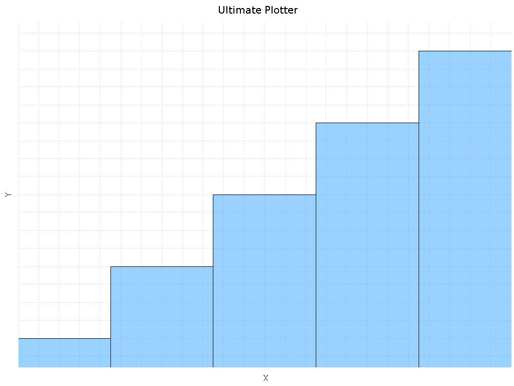
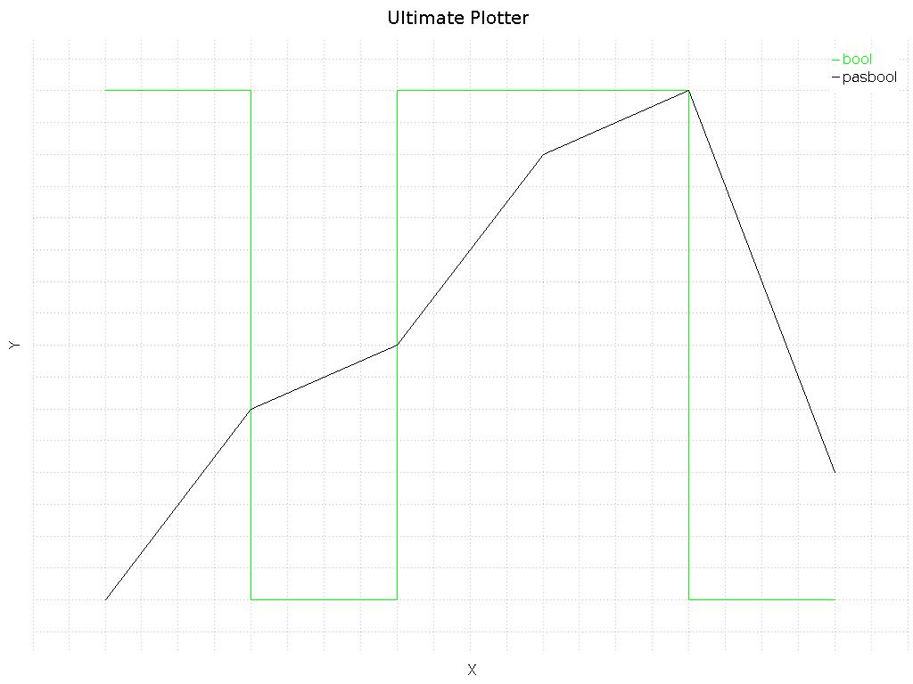
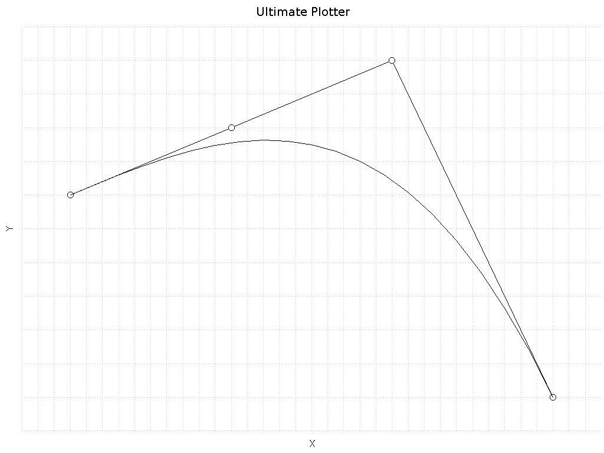
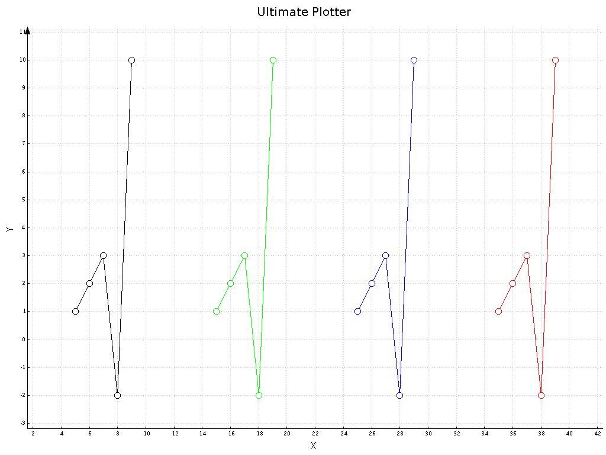
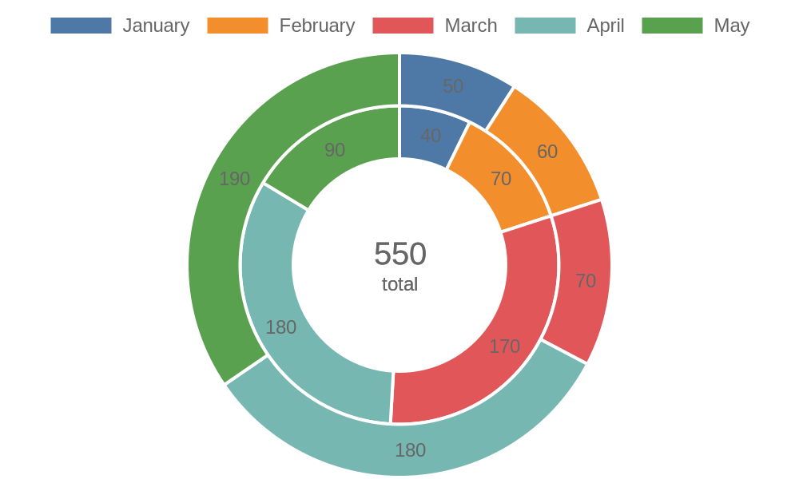

# API XY Charter - TER Equipe 13

# Introduction

This API has been created to be able to render 2D graphs, you can use it to render different type of graphs !

 # Summary 
- [User Manual](#User-Manual)
- [Documentation](#Documentation)
- [Docker](#Docker)
- [Setup the project](#Setup-the-project)


# User Manual
- [Type of graph](#Chart)
- [How to create a new chart](#Example-of-how-to-create-a-new-chart) 
- [How to create a new data](#Example-of-how-to-add-new-data) 
- [How to create a timeseries data](#Example-of-how-to-add-timeseries-data) 
- [How to add data in a chart](#Example-of-how-to-add-data-in-a-chart) 
- [How to visualize a chart](#Example-of-how-to-visualize-a-chart) 
- [Complete example with a doughnut](#Complete-example-with-a-creation-of-a-doughnut) 


# Documentation
The documentation on each service is automatically generated by swagger
Here is an example to generate doc on the database reader service
```bash
$ cd Services
$ cd databaseReader
$ npm install
$ npm run swagger-autogen
```
# Dependencies

processes are managed with pm2. Please intall it globally
```bash
$ npm install -g pm2
```

# Easy Start
Each service can be run on docker, to clean, build and setup all dockers run the file "clean-build-and-run-all-docker"
```bash
$ sh clean-build-and-run-all-docker
```

note that the IP address of the front-end should be shown on the console once everything is running.
to create a demo data set,
```bash
$ cd demo
$ npm install
$ npm run testNum
```
you can then go to the front end or use the createGraph script with the id of the dataSet as argument
```bash
$ sh createGraph.sh 1
```

**Important :** If you run the docker containers manually, Influx db needs to be run independently and before building other services, it is not in the docker compose by default.

You can run each service independently by running these commands
```bash
$ docker build --tag $container_name .
$ docker run --publish $port:$port --detach --name $name $container_name  
$ docker network connect xycharter_default $name
```

##  Chart

There is four different types of chart that you can create with the API 

#### histogramme



#### connectedLine


#### bezierCurve



#### circlePoint


#### doughnut


## Example of how to create a new chart 
**URL**
```json
    HTTP : POST http://URLAPI/graphs
```

**body**
```json
{
    "name": "exampleGraph",
    "type": "bezierCurve"
}
```
**Response** 
```json
    "1"
```
**Important :** Save the id of the graph created, it will be used in other request to  manipulate the chart

## Example of how to add new data
- #### How to add data for connectedLines/bezierCurve/circlePoints
    **URL**
    ```json
        HTTP : POST http://URLAPI/dataSets
    ```
    **body**
    ```json
    {
        "name" : "exampleData",
        "points" : [{"x": 20,"y":15},{"x": 5,"y":10}]
    }
    ```
    **Response** 
    ```json
        "1" 
    ```
    ***Important :*** Save the id of the dataset created, it will be used in other request to  manipulate this data 
    
	


- #### Example of how to add new data for doughnut
- **URL**
    ```json
        HTTP : POST http://URLAPI/dataSets
    ```
    **body**
    ```json
    {
        "name" : "exampleDataDoughnut",
        "points" : [{"label": "January","value":15},{"label": "October","value":10}]
    }
    ```
    **Response** 
    ```json
        "1" 
    ```
    ***Important :*** Save the id of the dataset created, it will be used in other request to  manipulate this data 
    
## Example of how to add timeseries data
### 1 - Get a key
- **URL**
    ```json
        HTTP : GET http://URLAPI/dataSets/timeseries
    ```
    **Response** 
    ```json
        "1" 
    ```
    ***Important :*** Save the id of the dataset created, it will be used in other request to  manipulate this data
### 2 - Add data with the key
- **URL**
    ```json
        HTTP : POST http://URLAPI/dataSets/timeseries
    ```
    **body**
    ```json
    {
        "name" : "exampleDataTimeSeries",
        "id" : "1",
        "timestamp": 1608128325,
        "value" : 152
    }
    ```
    
## Example of how to add data in a chart

In this section we will see how we can add data in a chart previously created.

To add data in chart we need the **id of the graph** and the **id of the dataset**
- **URL**
    ```json
        HTTP : POST http://URLAPI/graphs/1/dataSet/1
    ```
    **Response** 
    ```json
        "ADDED" 
    ```
    
We should see in the response "ADDED" to be sure that the datasets has been added to the graph

## Example of how to visualize a chart

- **URL**
    ```json
        HTTP : GET http://URLAPI/graphs/1/render?type=JPG
    ```
    **Response** 
    ```json
        "{jpg in base64}"  
    ```
The response will be the image jpg encoded in base 64

## Complete example with a creation of a doughnut
Learn how to render a graph in only 4 steps !

In this section we will do a complete example with the creation of a doughnut and his data associated, Let's go !
### 1- Creating a chart of type “doughnut” 
- **URL**
    ```json
        HTTP : POST http://URLAPI/graphs
    ```
    **body**
    ```json
    {
        "name" : "graphDoughnut",
        "type" : "doughnut"
    }
    ```
    **Response** 
    ```json
        "1" 
    ```
### 2- Creating a dataset for the doughnut 
- **URL**
    ```json
        HTTP : POST http://URLAPI/dataSets
    ```
    **body**
    ```json
    {
        "points" :  [
        {
          "label": "January",
          "value": 50
        },
        {
          "label": "February",
          "value": 60
        },
        {
          "label": "March",
          "value": 70
        },
        {
          "label": "April",
          "value": 180
        },
        {
          "label": "May",
          "value": 190
        }
      ]

    }
    ```
    **Response** 
    ```json
        "1" 
    ```
### 3- Associate the dataset and the graph doughnut 
- **URL**
    ```json
        HTTP : POST http://URLAPI/graphs/1/dataSet/1
    ```
 
    **Response** 
    ```json
        "ADDED" 
    ```
### 4- Visualize the doughnut !
- **URL**
    ```json
        HTTP : GET /graphs/1/render?type=JPG
    ```
 
    **Response** 
    ```json
        "{jpg in base64}"
    ```
    Here is the doughnut that we have created 

     


    Don't forget, a graph can have several datasets and a dataset several graphs.
